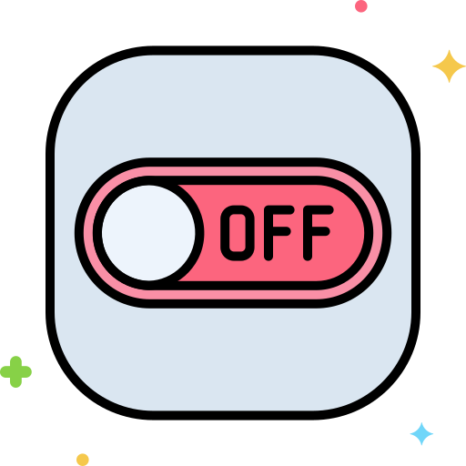

<div align="center">
  <br/>
  
  <br/><br/>

  <h1>Windows Shutdown Timer</h1>

  <p>Schedule a shutdown, restart, sleep, or hibernate on Windows.<br/>
  Built with Python and PySide6. Bilingual Eng(TH) interface. No bloat. No background agents.</p>

  <br/>

  [](https://www.python.org/)&nbsp;
  [](https://doc.qt.io/qtforpython-6/)&nbsp;
  [](https://www.microsoft.com/windows)&nbsp;
  [](LICENSE)

  <br/><br/>

</div>

---

## Getting Started

```bash
git clone https://github.com/kainapat/Windows-Shutdown-Timer.git
cd Windows-Shutdown-Timer
pip install -r requirements.txt
python shutdown_timer.py
```

> Requires Python 3.10+ on Windows 7 or later.

---

## What it does

Pick a power action and a time. The app schedules it and counts down. When the timer hits zero, Windows shuts down (or restarts, sleeps, or hibernates — whichever you chose). Cancel any time from inside the app or with `Ctrl+C` in the terminal.

**Scheduling modes**

| Mode | How it works |
|---|---|
| **Quick preset** | One click — 15 Min (15 นาที), 30 Min (30 นาที), 1 Hr (1 ชม.), or 2 Hrs (2 ชม.) from now |
| **Clock (ระบุเวลาจริง)** | Pick a date and exact clock time using calendar popup |
| **Timer (นับถอยหลัง)** | Set hours, minutes, and seconds (`hr`, `min`, `sec`) |

**The interface**

The UI features a **Simplified 3-Step Vertical Flow** designed with **Windows 11 Fluent & Bento Aesthetics**:
1. **Hero Countdown Display (Top)**: High-contrast monospace digits (`00:00:00`), live progress bar (`Remaining / เหลือ`), and real-time bilingual status indicator.
2. **Step 1 — Select Action (เลือกการกระทำ)**: Segmented pill buttons for `Shutdown (ปิดเครื่อง)`, `Restart (รีสตาร์ท)`, `Sleep (พักเครื่อง)`, or `Hibernate (จำศีล)` with dynamic color accent switching.
3. **Step 2 — Set Time (กำหนดเวลา)**: Elevated Quick Preset cards + Segmented mode switcher (`Timer / นับถอยหลัง` vs `Clock / ระบุเวลาจริง`) + Smooth sliding numerical inputs.
4. **Step 3 — Controls (เริ่มการทำงาน)**: Prominent `▶ Start Countdown (เริ่มนับถอยหลัง)` button with `✕ Cancel (ยกเลิก)` and `↺ Reset (ล้างค่า)` controls.

**Themes & Typography**

- **Soft Slate Grey Light Mode**: Gentle, glare-free matte slate canvas (`#d8dce2`), soft cards (`#e8ecf1`), and crisp input borders to eliminate eye strain.
- **Fluent Dark Mode**: Deep OLED black (`#09090b`) with refined dark grey cards (`#18181b`).
- **Modern Loopless Typography**: Clean sans-serif font stack prioritizing **IBM Plex Sans Thai**, **Kanit**, **Leelawadee UI**, and **Segoe UI Variable Display**.
- **Full Bilingual Eng(TH) Support**: English labels accompanied by clear Thai terminology across all cards, buttons, units, dialogs, and toast notifications.

Everything is native PySide6. No web renderer, no Electron, no external background service.

---

## Under the Hood

The app calls native Windows CLI tools directly — no drivers, no services:

```
Shutdown   →  shutdown /s /t <seconds>
Restart    →  shutdown /r /t <seconds>
Sleep      →  rundll32.exe powrprof.dll,SetSuspendState 0,1,0
Hibernate  →  rundll32.exe powrprof.dll,SetSuspendState 1,1,0
Cancel     →  shutdown /a
```

A few reliability details: config is written atomically (temp file → rename) to survive power loss mid-write. Any existing Windows shutdown task is cancelled before a new one is scheduled. `Ctrl+C` / `Ctrl+Break` aborts silently — no confirmation dialog.

---

## Building a Standalone `.exe`

The included PyInstaller spec bundles all icon assets into a single standalone executable. Run:

```bash
pip install pyinstaller
pyinstaller "Windows Shutdown Timer.spec" --clean
```

Output lands at `dist/Windows Shutdown Timer.exe`. The multi-resolution icon (`off.ico`, resolutions from 16 to 256 px) is embedded directly inside the executable.

---

## Architecture & Diagrams

The project includes four self-contained, accessible architecture diagrams located in the [`diagram/`](diagram/) directory:

| Diagram | File | Description |
|---|---|---|
| **Component Diagram** | [`diagram/component-diagram.html`](diagram/component-diagram.html) | 3-Tier internal architecture (Presentation, Core Controller, OS & Storage) |
| **Context Diagram (Level 0)** | [`diagram/context-diagram.html`](diagram/context-diagram.html) | System boundary and interaction with User, Windows OS, and Local Config |
| **Data Flow Diagram (DFD)** | [`diagram/data-flow-diagram.html`](diagram/data-flow-diagram.html) | 5-stage data & state lifecycle across 4 architectural roles |
| **Sequence Diagram** | [`diagram/sequence-diagram.html`](diagram/sequence-diagram.html) | Chronological request/response trace with `ALT` branching (completion vs cancel) |

> Open any `.html` file in a web browser to view the diagram with full editorial styling and interactive accessibility.

---

## Project Layout

```
Windows Shutdown Timer/
├── shutdown_timer.py             # All application code
├── requirements.txt              # PySide6 >= 6.4.0
├── off.png / off.ico             # App icon — source PNG and multi-res ICO
├── Windows Shutdown Timer.spec   # PyInstaller spec
├── timer_config.json             # Runtime — cleared on exit
├── window_config.json            # Window size, position, and theme mode
└── diagram/                      # Standalone Architecture & System Diagrams (HTML)
    ├── component-diagram.html    # 3-Tier Component Architecture
    ├── context-diagram.html      # Level 0 System Context
    ├── data-flow-diagram.html    # 5-Stage Data Flow Diagram (DFD)
    └── sequence-diagram.html     # Execution & Cancellation Sequence
```

---

## Changelog

<details open>
<summary><strong>v2.2.0</strong> &nbsp;·&nbsp; August 2026 &nbsp;·&nbsp; <em>Comprehensive Architecture & System Diagrams</em></summary>
<br/>

- **System Architecture Diagrams**: Added 4 interactive editorial diagrams (`Component`, `Context`, `Data Flow`, and `Sequence`) in [`diagram/`](diagram/) built with standalone Accessible SVG and 4px-grid alignment.
- **Strict Specification Compliance**: All diagrams passed `diagram-design` taste gate with WCAG AA contrast and right-angle orthogonal routing.
- **Git Hygiene**: Configured `.gitignore` to exclude local agent skills while tracking diagrams.

</details>

<details>
<summary><strong>v2.1.0</strong> &nbsp;·&nbsp; August 2026 &nbsp;·&nbsp; <em>Soft Slate Grey Light Mode & Bilingual Loopless UI</em></summary>
<br/>

- **Soft Slate Grey Light Mode**: Overhauled Light Theme to a soft matte slate grey palette (`#d8dce2` canvas, `#e8ecf1` bento cards) to eliminate harsh white glare and eye strain.
- **Modern Loopless Typography**: Integrated modern Thai loopless font hierarchy prioritizing `'IBM Plex Sans Thai'`, `'Kanit'`, `'Leelawadee UI'`, and `'Segoe UI Variable'`.
- **Complete Eng(TH) Bilingual Layout**: Updated all UI card headers, action buttons, mode switches, time units, status messages, confirmation dialogs, and toast alerts to bilingual Eng(TH) format.
- **Dynamic Action-Tinted Gradients**: Soft radial accents tuned specifically for both Light (Soft Slate) and Dark modes.
- **Layout Robustness**: Added `QLayout.SetMinimumSize` constraint to guarantee responsive card sizing without widget overlap.

</details>

<details>
<summary><strong>v2.0.0</strong> &nbsp;·&nbsp; August 2026 &nbsp;·&nbsp; <em>UX/UI Redesign & High Contrast Overhaul</em></summary>
<br/>

- **3-Step Vertical Flow**: Replaced 5-card Bento grid with a top-to-bottom logical flow (Hero Display -> Step 1 Action -> Step 2 Time & Presets -> Step 3 Controls).
- **100% WCAG AA Text Contrast**: Solved dark/light text readability issues across all card titles, labels, inputs, and buttons.
- **Dynamic Action Colors**: Active color accents shift automatically per action (Red for Shutdown, Orange for Restart, Blue for Sleep, Purple for Hibernate).
- **Quick Preset Chips**: Elevated `15m`, `30m`, `1h`, `2h` chips for instant 1-click scheduling.

</details>

<details>
<summary><strong>v1.9.0</strong> &nbsp;·&nbsp; July 2026 &nbsp;·&nbsp; <em>Custom Icon</em></summary>
<br/>

Converted `off.png` to `off.ico` with six embedded resolutions (16 → 256 px). Windows picks the sharpest size for each context (title bar, taskbar, Alt+Tab). A `resource_path()` helper resolves asset paths correctly in both dev and PyInstaller-frozen modes. The spec was updated to embed both icon files.

</details>

<details>
<summary><strong>v1.8.0</strong> &nbsp;·&nbsp; June 2026 &nbsp;·&nbsp; <em>Light Mode</em></summary>
<br/>

Added a theme toggle in the window header. The Light Mode uses soft pastel styling matched to the active power action. Theme choice persists across sessions.

</details>

---

## License

MIT
