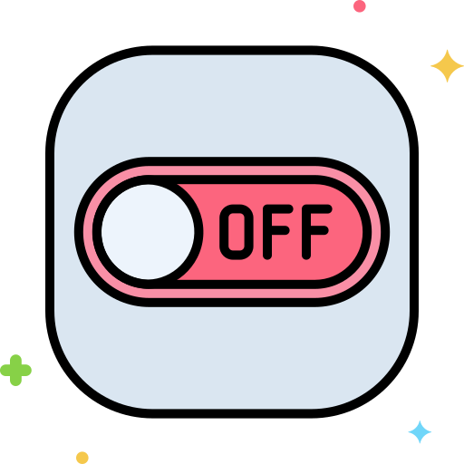
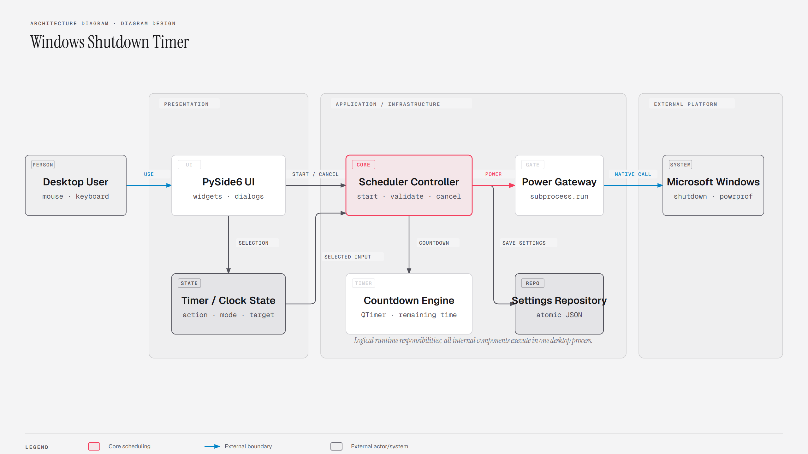
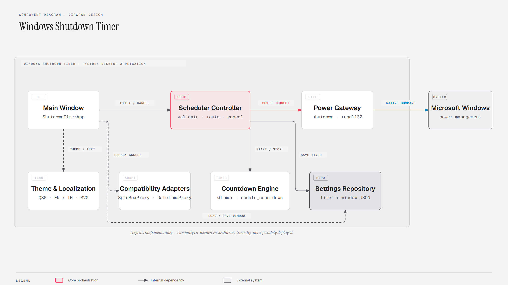
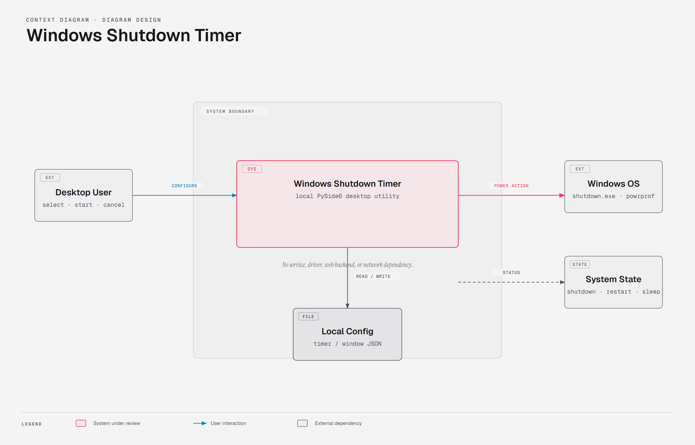
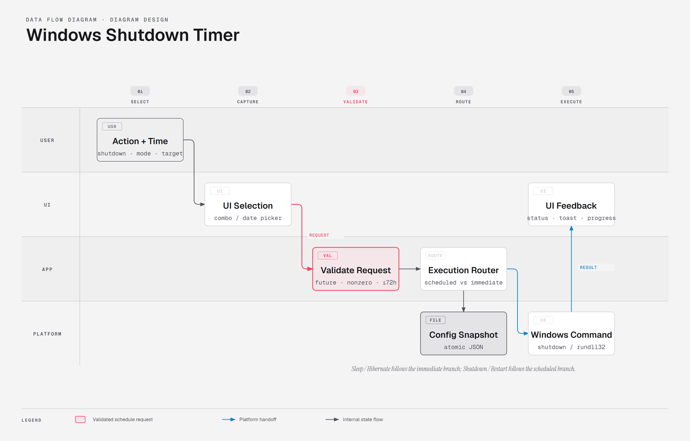
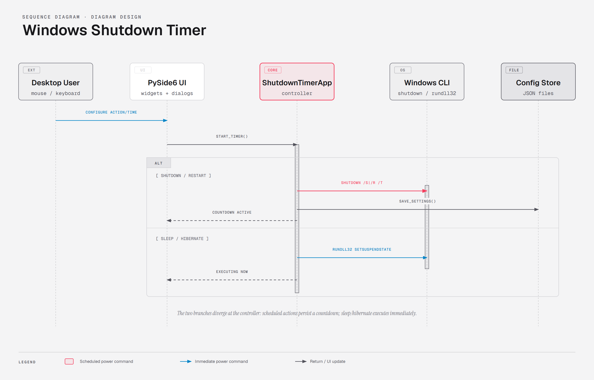
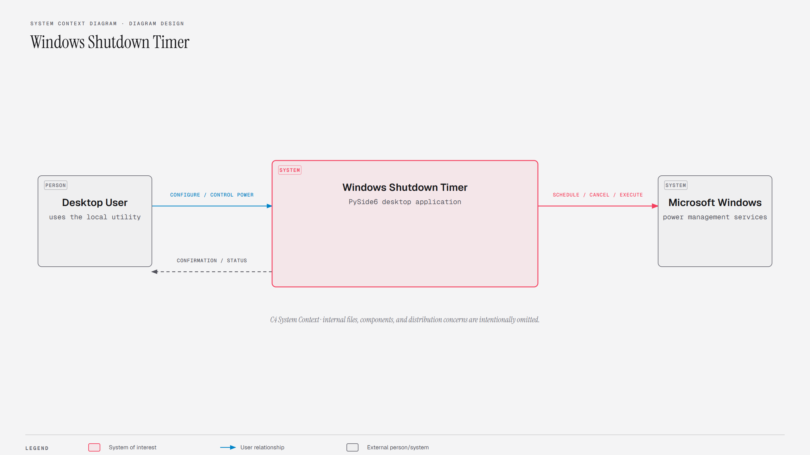

<div align="center">
  <br/>
  
  <br/><br/>

  <h1>Windows Shutdown Timer</h1>

  <p>Schedule Windows shutdown or restart, or trigger sleep / hibernate immediately.<br/>
  Modern Raycast / Linear Precision interface. Zero emoji clutter. Bilingual (EN | TH). Fixed utility footprint. No background bloat.</p>

  <br/>

  [](https://www.python.org/)&nbsp;
  [](https://doc.qt.io/qtforpython-6/)&nbsp;
  [](https://www.microsoft.com/windows)&nbsp;
  [](#license)

  <br/><br/>

</div>

---

## Getting Started

```bash
git clone https://github.com/kainapat/Windows-Shutdown-Timer.git
cd Windows-Shutdown-Timer
pip install -r requirements.txt
python shutdown_timer.py
```

> Requires Python 3.10+ on Windows. Exact OS compatibility depends on the installed PySide6 / Qt release.

---

## What it does

Choose one of four power actions:

- **Shutdown / Restart** are schedulable. Pick a relative duration or an absolute clock time, then the app schedules the Windows action and displays a live countdown.
- **Sleep / Hibernate** are immediate actions in the current implementation. After confirmation, the app invokes the Windows suspend path immediately; Timer / Clock values are not used for these two actions.

**Scheduling Modes**

| Mode | How it works |
|---|---|
| **Quick Presets** | One-click `15m`, `30m`, `1h`, or `2h` schedules for **Shutdown / Restart only** |
| **Timer (นับถอยหลัง)** | Relative schedule for **Shutdown / Restart** using Hours (`0`–`24 hr`), Minutes (`0`–`59 min`), and Seconds (`0`–`59 sec`) |
| **Clock (ระบุเวลาจริง)** | Absolute schedule for **Shutdown / Restart** using a date picker plus hour (`00`–`23`) and minute (`00`–`59`) dropdowns |
| **Sleep / Hibernate** | Immediate execution after confirmation; no countdown is created |

> **Important:** use **Cancel** to abort an active Windows shutdown / restart schedule. **Reset** only clears UI fields/configuration and does not issue `shutdown /a`. Closing the app also stops the in-app countdown display but does not cancel a shutdown / restart already handed to Windows.

**The Interface (Raycast / Linear Precision Style)**

1. **Precision Countdown Chronometer (Hero Card)**: High-contrast monospace digits (`00:00:00`), live LED status indicator dot (green when running), and a slim 3px micro-progress line.
2. **Action Selector (`ACTION`)**: Sleek pill buttons for `Shutdown`, `Restart`, `Sleep`, and `Hibernate` with monochrome vector SVG icons and desaturated semantic color accents.
3. **Duration & Mode (`DURATION`)**: Minimalist preset chips (`15m`, `30m`, `1h`, `2h`), segmented pill tab switch (`Timer` vs `Clock`) with zero native radio artifacts, and dropdown pickers with custom vector chevrons.
4. **Ergonomic Bottom Action Bar**: Unified bottom controls featuring secondary `Cancel` and `Reset` buttons on the left, and a prominent `Start Countdown` button on the right.
5. **Fixed Utility Footprint (520 × 560 px)**: Dedicated utility window sizing (similar to Windows Calculator / native widgets) that prevents awkward vertical stretching or detached buttons on high-resolution displays.

**Themes & Eye-Comfort Palette**

- **Eye-Comfort Light Mode**: Soft concrete grey canvas (`#D8D8D8`) with pure white layered cards (`#FFFFFF`) and subtle `#C0C0C0` borders to eliminate harsh glare and eye strain.
- **Deep Zinc Dark Mode**: Modern GitHub/Linear-inspired dark canvas (`#0d1117`) with `#161b22` card surfaces and `#30363d` subtle 1px borders.
- **Dedicated Dynamic Localization (`EN` | `TH`)**: Quick toggle button in the header cleanly switches the entire interface between English and Thai without messy parenthetical stacking.
- **Zero Emoji Slop**: 100% crisp vector SVG icons rendered via `PySide6.QtSvg` at High-DPI.

Everything is native PySide6. No web renderer, no Electron, no external background service.

---

## Under the Hood

The app delegates power operations to Windows directly — no driver and no background service:

| Action | Current runtime path |
|---|---|
| **Shutdown** | `shutdown /s /t <seconds>` |
| **Restart** | `shutdown /r /t <seconds>` |
| **Sleep** | `rundll32.exe powrprof.dll,SetSuspendState 0,1,0` — immediate |
| **Hibernate** | `rundll32.exe powrprof.dll,SetSuspendState 1,1,0` — immediate |
| **Cancel scheduled shutdown/restart** | `shutdown /a` |

Runtime flow for a scheduled Shutdown / Restart:

```text
User
  → PySide6 UI
  → Scheduler Controller
  → validate Timer / Clock target (future, non-zero, max 72h)
  → abort previous Windows shutdown request
  → shutdown.exe /s|/r /t <seconds>
  → QTimer countdown + status/progress updates
  → atomic JSON settings write
```

A few reliability details:
- Timer settings use temp-file + `os.replace()` atomic writes.
- Any existing Windows shutdown request is aborted before a new Shutdown / Restart schedule is created.
- `Ctrl+C` / `Ctrl+Break` calls `cancel_timer(confirm=False)` when the app still tracks an active schedule.
- **Reset is not Cancel**: Reset clears fields/configuration but does not issue `shutdown /a`.
- Closing the GUI stops the local QTimer and deletes the timer config, but a Shutdown / Restart already scheduled in Windows continues unless explicitly cancelled.
- Backward-compatibility proxies (`SpinBoxProxy`, `DateTimeProxy`, legacy aliases) preserve older configuration access patterns.

---

## Building a Standalone `.exe`

The included PyInstaller spec bundles all icon and SVG assets into a single standalone executable:

```bash
pip install pyinstaller
pyinstaller "Windows Shutdown Timer.spec" --clean
```

Output lands at `dist/Windows Shutdown Timer.exe`.

---

## Architecture & Documentation

- **Architecture Decision Records (ADRs)**: Located in [`docs/adr/`](docs/adr/):
  - [ADR 0001: Clickable Dropdown Time Selectors](docs/adr/0001-dropdown-time-selectors.md)
  - [ADR 0002: Raycast / Linear Modern Precision UI Redesign](docs/adr/0002-linear-precision-redesign.md)
  - [ADR 0003: Eye-Comfort Light Palette (#D8D8D8) & Fixed Window Dimensions](docs/adr/0003-eye-comfort-light-palette-and-fixed-window.md)
- **Interactive Architecture Explorer (Archify)**:
  - [Open `diagram/interactive/index.html`](diagram/interactive/index.html)
  - Click/focus nodes to inspect responsibilities and verified source references.
  - Includes Node Finder, Semantic Lens, PATH Route Probe, Light/Dark themes, deep links, and canonical export controls.
  - Repository evidence is pinned to the commit recorded in [`candidate.json`](diagram/interactive/candidate.json).
- **Static architecture set** — every view has Light/Dark HTML plus matching SVG and PNG exports:
  - [Architecture](diagram/architecture-diagram-light.html) · runtime UI → scheduler → Windows boundary
  - [Component](diagram/component-diagram-light.html) · logical components currently co-located in `shutdown_timer.py`
  - [Context](diagram/context-diagram-light.html) · Level-0 runtime context
  - [Data Flow](diagram/data-flow-diagram-light.html) · selection → validation → execution → feedback
  - [Sequence](diagram/sequence-diagram-light.html) · scheduled vs immediate power branches
  - [System Context](diagram/system-context-diagram-light.html) · local runtime plus distribution boundary

### Diagram Gallery

<p align="center">
  <a href="diagram/architecture-diagram-light.html">
    
  </a>
  <a href="diagram/component-diagram-light.html">
    
  </a>
</p>

<p align="center">
  <strong>Architecture</strong> &nbsp;·&nbsp; <strong>Component</strong>
</p>

<p align="center">
  <a href="diagram/context-diagram-light.html">
    
  </a>
  <a href="diagram/data-flow-diagram-light.html">
    
  </a>
</p>

<p align="center">
  <strong>Context</strong> &nbsp;·&nbsp; <strong>Data Flow</strong>
</p>

<p align="center">
  <a href="diagram/sequence-diagram-light.html">
    
  </a>
  <a href="diagram/system-context-diagram-light.html">
    
  </a>
</p>

<p align="center">
  <strong>Sequence</strong> &nbsp;·&nbsp; <strong>System Context</strong>
</p>

> Click any diagram image to open its full HTML view. Dark-mode variants are available beside the Light versions in [`diagram/`](diagram/).

### Regenerating static diagrams

```bash
cd diagram
python generate_diagrams.py
python export_png.py
python verify_render_match.py
```

`export_png.py` uses Playwright with an installed Chrome/Edge executable. `verify_render_match.py` checks that browser-rendered HTML, standalone SVG, and PNG exports stay visually aligned.

---

## Project Layout

```text
Windows Shutdown Timer/
├── shutdown_timer.py               # PySide6 application + scheduling logic
├── requirements.txt                # Runtime Python dependencies
├── Windows Shutdown Timer.spec     # PyInstaller build definition
├── off.png / off.ico               # Application icon assets
├── chevron_dark.svg
├── chevron_light.svg
├── CONTEXT.md                      # Canonical domain vocabulary
├── docs/adr/                       # Architecture Decision Records
│   ├── 0001-dropdown-time-selectors.md
│   ├── 0002-linear-precision-redesign.md
│   └── 0003-eye-comfort-light-palette-and-fixed-window.md
└── diagram/
    ├── architecture-diagram-{light,dark}.{html,svg,png}
    ├── component-diagram-{light,dark}.{html,svg,png}
    ├── context-diagram-{light,dark}.{html,svg,png}
    ├── data-flow-diagram-{light,dark}.{html,svg,png}
    ├── sequence-diagram-{light,dark}.{html,svg,png}
    ├── system-context-diagram-{light,dark}.{html,svg,png}
    ├── generate_diagrams.py
    ├── export_png.py
    ├── verify_render_match.py
    └── interactive/
        ├── candidate.json           # Archify source with repository evidence
        └── index.html               # Interactive Architecture Explorer
```

Runtime-generated `timer_config.json` and `window_config.json` are intentionally ignored by Git.

---

## Changelog

<details open>
<summary><strong>v2.4.0</strong> &nbsp;·&nbsp; September 2026 &nbsp;·&nbsp; <em>Raycast / Linear Precision Redesign & Eye-Comfort Palette</em></summary>
<br/>

- **Raycast / Linear Precision Aesthetics**: Completely redesigned the UI to an editorial precision desktop utility with subtle 1px borders, quiet section headers (`ACTION`, `DURATION`), and zero textbook numbering.
- **Zero Emoji Clutter**: Replaced all emojis with sharp, dynamically recolored vector SVG icons (`power`, `restart`, `moon`, `hibernate`, `globe`, `sun`, `play`, `cancel`, `reset`).
- **Dynamic Localization Engine (`EN` | `TH`)**: Instant language switching pill in the header; eliminated ugly parenthetical bilingual stacking.
- **Precision Chronometer Hero**: Tabular monospace digits, live LED status indicator dot, and a slim 3px micro-progress line.
- **Eye-Comfort Light Palette (`#D8D8D8`)**: Non-glaring concrete grey canvas with layered pure white cards and high-contrast dark zinc text.
- **Fixed Utility Footprint (520 × 560 px)**: Established a dedicated compact utility size preventing detached buttons or awkward empty space on widescreen monitors.
- **Segmented Pill Controls**: Built custom pushbutton-based segmented tab for `Timer` vs `Clock` with zero native Windows radio indicator artifacts.

</details>

<details>
<summary><strong>v2.3.0</strong> &nbsp;·&nbsp; September 2026 &nbsp;·&nbsp; <em>Clickable Dropdown Time Selectors & Symmetrical Layout</em></summary>
<br/>

- **Clickable Dropdown Time Selectors**: Replaced manual text-typing inputs with discrete `QComboBox` dropdowns and `QDateEdit` calendar popup.
- **Symmetrical 3-Column Layout**: Aligned both `Timer` and `Clock` modes into a balanced 3-column layout.
- **Backward-Compatible Proxy Layer**: Built `SpinBoxProxy` and `DateTimeProxy` adapters.

</details>

<details>
<summary><strong>v2.2.0</strong> &nbsp;·&nbsp; August 2026 &nbsp;·&nbsp; <em>Comprehensive Architecture & System Diagrams</em></summary>
<br/>

- **System Architecture Diagrams**: Added 4 interactive editorial diagrams (`Component`, `Context`, `Data Flow`, and `Sequence`) in [`diagram/`](diagram/).

</details>

<details>
<summary><strong>v2.1.0</strong> &nbsp;·&nbsp; August 2026 &nbsp;·&nbsp; <em>Soft Slate Grey Light Mode & Bilingual Loopless UI</em></summary>
<br/>

- **Soft Slate Grey Light Mode**: Initial eye-strain reduction palette.
- **Modern Loopless Typography**: Integrated Thai loopless font stack.

</details>

<details>
<summary><strong>v2.0.0</strong> &nbsp;·&nbsp; August 2026 &nbsp;·&nbsp; <em>UX/UI Redesign & High Contrast Overhaul</em></summary>
<br/>

- **3-Step Vertical Flow**: Replaced 5-card Bento grid with top-to-bottom flow.

</details>

---

## License

MIT
