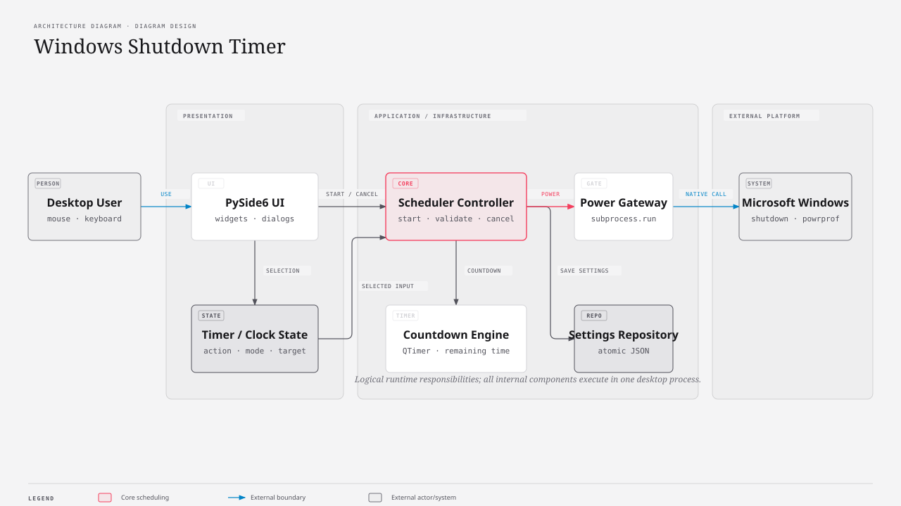
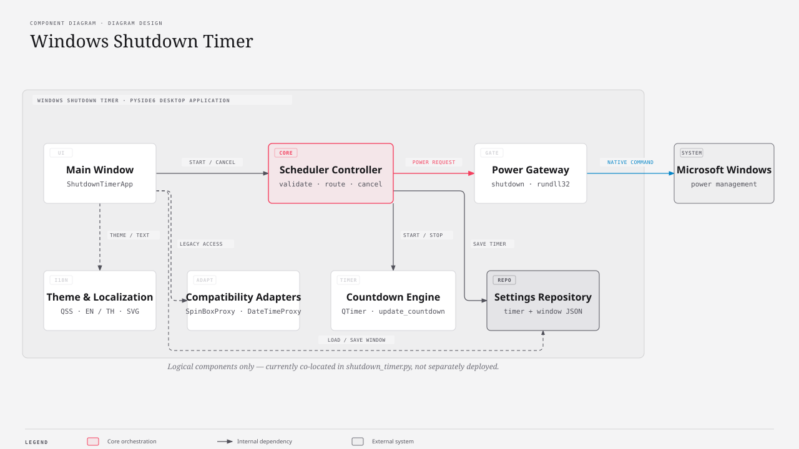
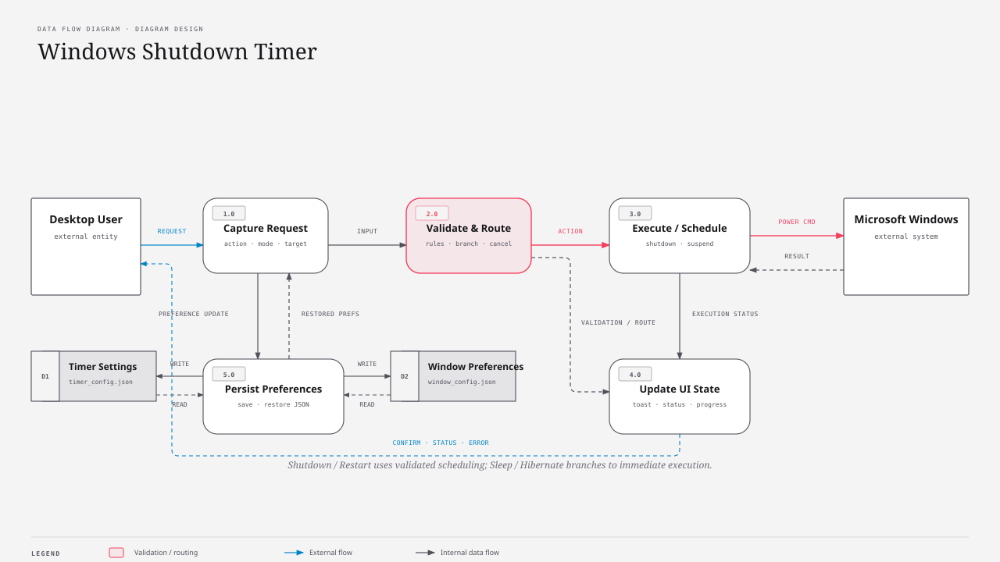
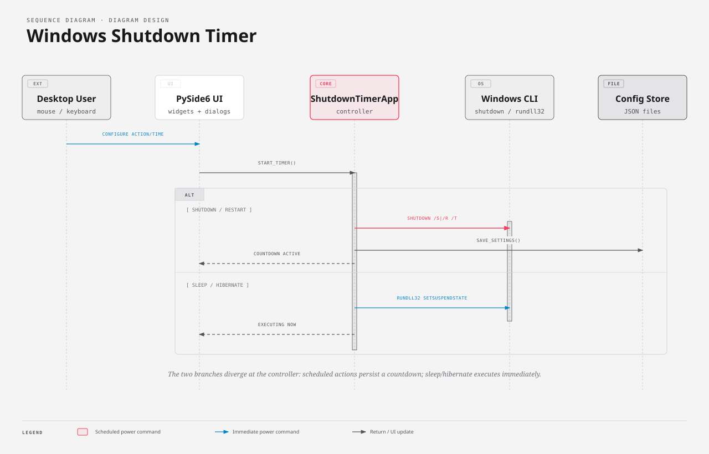
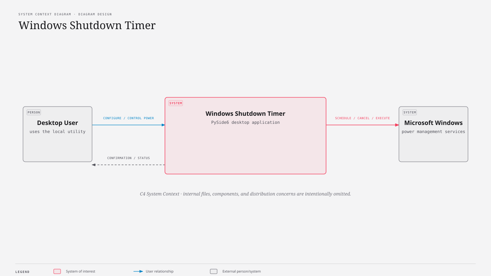

<div align="center">
  <br/>
  
  <br/><br/>

  <h1>Windows Shutdown Timer</h1>

  <p>Schedule Windows shutdown or restart, or trigger sleep / hibernate immediately.<br/>
  Modern Raycast / Linear Precision interface. Zero emoji clutter. Bilingual (EN | TH). Fixed utility footprint. No background bloat.</p>

  <br/>

  [](https://www.python.org/)&nbsp;
  [](https://doc.qt.io/qtforpython-6/)&nbsp;
  [](https://www.microsoft.com/windows)&nbsp;
  [](#license)

  <br/><br/>

  <a href="#getting-started">Get Started</a>
  &nbsp;·&nbsp;
  <a href="#highlights">Highlights</a>
  &nbsp;·&nbsp;
  <a href="#architecture-at-a-glance">Architecture</a>
  &nbsp;·&nbsp;
  <a href="diagram/interactive/index.html">Interactive Explorer</a>
  &nbsp;·&nbsp;
  <a href="#building-a-standalone-exe">Build</a>

  <br/><br/>

</div>

---

## Getting Started

```bash
git clone https://github.com/kainapat/Windows-Shutdown-Timer.git
cd Windows-Shutdown-Timer
pip install -r requirements.txt
python shutdown_timer.py
```

> Requires Python 3.10+ on Windows. Exact OS compatibility depends on the installed PySide6 / Qt release.

---

## Highlights

| Capability | Current behavior |
|---|---|
| **Shutdown / Restart** | Schedule by relative duration or absolute clock time, with a live countdown |
| **Sleep / Hibernate** | Execute immediately after confirmation; no countdown is created |
| **Quick Presets** | `15m`, `30m`, `1h`, `2h` for Shutdown / Restart only |
| **Timer Mode** | Hours, minutes, and seconds with a 72-hour scheduling limit |
| **Clock Mode** | Calendar date + hour + minute target |
| **Localization** | Instant English / Thai UI switching |
| **Themes** | Eye-comfort Light and Deep Zinc Dark |
| **Runtime** | Native PySide6 desktop app; no Electron, web backend, driver, or background service |

> **Cancel and Reset are intentionally different.** **Cancel** aborts an active Windows shutdown / restart request. **Reset** only clears the UI/configuration. Closing the app stops the local countdown display but does not cancel a shutdown / restart already handed to Windows.

---

## Architecture at a Glance

<p align="center">
  <a href="diagram/architecture-diagram-light.html">
    <picture>
      <source media="(prefers-color-scheme: dark)" srcset="./diagram/architecture-diagram-dark.svg">
      <source media="(prefers-color-scheme: light)" srcset="./diagram/architecture-diagram-light.svg">
      
    </picture>
  </a>
</p>

<p align="center">
  <a href="diagram/interactive/index.html"><strong>Open Interactive Architecture Explorer</strong></a>
  &nbsp;·&nbsp;
  <a href="diagram/architecture-diagram-light.html">Full HTML view</a>
</p>

---

## Under the Hood

The app delegates power operations to Windows directly — no driver and no background service:

| Action | Current runtime path |
|---|---|
| **Shutdown** | `shutdown /s /t <seconds>` |
| **Restart** | `shutdown /r /t <seconds>` |
| **Sleep** | `rundll32.exe powrprof.dll,SetSuspendState 0,1,0` — immediate |
| **Hibernate** | `rundll32.exe powrprof.dll,SetSuspendState 1,1,0` — immediate |
| **Cancel scheduled shutdown/restart** | `shutdown /a` |

Runtime flow for a scheduled Shutdown / Restart:

```text
User
  → PySide6 UI
  → Scheduler Controller
  → validate Timer / Clock target (future, non-zero, max 72h)
  → abort previous Windows shutdown request
  → shutdown.exe /s|/r /t <seconds>
  → QTimer countdown + status/progress updates
  → atomic JSON settings write
```

A few reliability details:
- Timer settings use temp-file + `os.replace()` atomic writes.
- Any existing Windows shutdown request is aborted before a new Shutdown / Restart schedule is created.
- `Ctrl+C` / `Ctrl+Break` calls `cancel_timer(confirm=False)` when the app still tracks an active schedule.
- **Reset is not Cancel**: Reset clears fields/configuration but does not issue `shutdown /a`.
- Closing the GUI stops the local QTimer and deletes the timer config, but a Shutdown / Restart already scheduled in Windows continues unless explicitly cancelled.
- Backward-compatibility proxies (`SpinBoxProxy`, `DateTimeProxy`, legacy aliases) preserve older configuration access patterns.

---

## Building a Standalone `.exe`

The included PyInstaller spec bundles all icon and SVG assets into a single standalone executable:

```bash
pip install pyinstaller
pyinstaller "Windows Shutdown Timer.spec" --clean
```

Output lands at `dist/Windows Shutdown Timer.exe`.

---

## Explore the Architecture

### Interactive Explorer

The checked [Archify explorer](diagram/interactive/index.html) adds node focus, verified source links, Node Finder, Semantic Lens, PATH Route Probe, deep links, Light/Dark themes, and canonical exports.

> Repository evidence for the interactive view is pinned in [`diagram/interactive/candidate.json`](diagram/interactive/candidate.json).

### Diagram Gallery

These previews use the existing SVG exports and automatically select a Light or Dark variant for the viewer. Click any preview to open its full HTML diagram.

<p align="center">
  <a href="diagram/component-diagram-light.html">
    <picture>
      <source media="(prefers-color-scheme: dark)" srcset="./diagram/component-diagram-dark.svg">
      <source media="(prefers-color-scheme: light)" srcset="./diagram/component-diagram-light.svg">
      
    </picture>
  </a>
  <a href="diagram/context-diagram-light.html">
    <picture>
      <source media="(prefers-color-scheme: dark)" srcset="./diagram/context-diagram-dark.svg">
      <source media="(prefers-color-scheme: light)" srcset="./diagram/context-diagram-light.svg">
      
    </picture>
  </a>
</p>

<p align="center"><strong>Component</strong> &nbsp;·&nbsp; <strong>Context</strong></p>

<p align="center">
  <a href="diagram/data-flow-diagram-light.html">
    <picture>
      <source media="(prefers-color-scheme: dark)" srcset="./diagram/data-flow-diagram-dark.svg">
      <source media="(prefers-color-scheme: light)" srcset="./diagram/data-flow-diagram-light.svg">
      
    </picture>
  </a>
  <a href="diagram/sequence-diagram-light.html">
    <picture>
      <source media="(prefers-color-scheme: dark)" srcset="./diagram/sequence-diagram-dark.svg">
      <source media="(prefers-color-scheme: light)" srcset="./diagram/sequence-diagram-light.svg">
      
    </picture>
  </a>
</p>

<p align="center"><strong>Data Flow</strong> &nbsp;·&nbsp; <strong>Sequence</strong></p>

<p align="center">
  <a href="diagram/system-context-diagram-light.html">
    <picture>
      <source media="(prefers-color-scheme: dark)" srcset="./diagram/system-context-diagram-dark.svg">
      <source media="(prefers-color-scheme: light)" srcset="./diagram/system-context-diagram-light.svg">
      
    </picture>
  </a>
</p>

<p align="center"><strong>System Context</strong></p>

> The **Architecture** hero above plus these five focused views form the complete static diagram set. Each preview links to its full HTML view; matching SVG and PNG exports live in [`diagram/`](diagram/).

### Architecture Decisions

- [ADR 0001 — Clickable Dropdown Time Selectors](docs/adr/0001-dropdown-time-selectors.md)
- [ADR 0002 — Raycast / Linear Modern Precision UI Redesign](docs/adr/0002-linear-precision-redesign.md)
- [ADR 0003 — Eye-Comfort Light Palette & Fixed Window Dimensions](docs/adr/0003-eye-comfort-light-palette-and-fixed-window.md)

### Regenerating static diagrams

```bash
cd diagram
python generate_diagrams.py
python export_png.py
python verify_render_match.py
```

`export_png.py` uses Playwright with an installed Chrome/Edge executable. `verify_render_match.py` checks that browser-rendered HTML, standalone SVG, and PNG exports stay visually aligned.

---

## Project Layout

```text
Windows Shutdown Timer/
├── shutdown_timer.py               # PySide6 application + scheduling logic
├── requirements.txt                # Runtime Python dependencies
├── Windows Shutdown Timer.spec     # PyInstaller build definition
├── off.png / off.ico               # Application icon assets
├── chevron_dark.svg
├── chevron_light.svg
├── CONTEXT.md                      # Canonical domain vocabulary
├── docs/adr/                       # Architecture Decision Records
│   ├── 0001-dropdown-time-selectors.md
│   ├── 0002-linear-precision-redesign.md
│   └── 0003-eye-comfort-light-palette-and-fixed-window.md
└── diagram/
    ├── architecture-diagram-{light,dark}.{html,svg,png}
    ├── component-diagram-{light,dark}.{html,svg,png}
    ├── context-diagram-{light,dark}.{html,svg,png}
    ├── data-flow-diagram-{light,dark}.{html,svg,png}
    ├── sequence-diagram-{light,dark}.{html,svg,png}
    ├── system-context-diagram-{light,dark}.{html,svg,png}
    ├── generate_diagrams.py
    ├── export_png.py
    ├── verify_render_match.py
    └── interactive/
        ├── candidate.json           # Archify source with repository evidence
        └── index.html               # Interactive Architecture Explorer
```

Runtime-generated `timer_config.json` and `window_config.json` are intentionally ignored by Git.

---

## Changelog

<details open>
<summary><strong>v2.4.0</strong> &nbsp;·&nbsp; September 2026 &nbsp;·&nbsp; <em>Raycast / Linear Precision Redesign & Eye-Comfort Palette</em></summary>
<br/>

- **Raycast / Linear Precision Aesthetics**: Completely redesigned the UI to an editorial precision desktop utility with subtle 1px borders, quiet section headers (`ACTION`, `DURATION`), and zero textbook numbering.
- **Zero Emoji Clutter**: Replaced all emojis with sharp, dynamically recolored vector SVG icons (`power`, `restart`, `moon`, `hibernate`, `globe`, `sun`, `play`, `cancel`, `reset`).
- **Dynamic Localization Engine (`EN` | `TH`)**: Instant language switching pill in the header; eliminated ugly parenthetical bilingual stacking.
- **Precision Chronometer Hero**: Tabular monospace digits, live LED status indicator dot, and a slim 3px micro-progress line.
- **Eye-Comfort Light Palette (`#D8D8D8`)**: Non-glaring concrete grey canvas with layered pure white cards and high-contrast dark zinc text.
- **Fixed Utility Footprint (520 × 560 px)**: Established a dedicated compact utility size preventing detached buttons or awkward empty space on widescreen monitors.
- **Segmented Pill Controls**: Built custom pushbutton-based segmented tab for `Timer` vs `Clock` with zero native Windows radio indicator artifacts.

</details>

<details>
<summary><strong>v2.3.0</strong> &nbsp;·&nbsp; September 2026 &nbsp;·&nbsp; <em>Clickable Dropdown Time Selectors & Symmetrical Layout</em></summary>
<br/>

- **Clickable Dropdown Time Selectors**: Replaced manual text-typing inputs with discrete `QComboBox` dropdowns and `QDateEdit` calendar popup.
- **Symmetrical 3-Column Layout**: Aligned both `Timer` and `Clock` modes into a balanced 3-column layout.
- **Backward-Compatible Proxy Layer**: Built `SpinBoxProxy` and `DateTimeProxy` adapters.

</details>

<details>
<summary><strong>v2.2.0</strong> &nbsp;·&nbsp; August 2026 &nbsp;·&nbsp; <em>Comprehensive Architecture & System Diagrams</em></summary>
<br/>

- **System Architecture Diagrams**: Added 4 interactive editorial diagrams (`Component`, `Context`, `Data Flow`, and `Sequence`) in [`diagram/`](diagram/).

</details>

<details>
<summary><strong>v2.1.0</strong> &nbsp;·&nbsp; August 2026 &nbsp;·&nbsp; <em>Soft Slate Grey Light Mode & Bilingual Loopless UI</em></summary>
<br/>

- **Soft Slate Grey Light Mode**: Initial eye-strain reduction palette.
- **Modern Loopless Typography**: Integrated Thai loopless font stack.

</details>

<details>
<summary><strong>v2.0.0</strong> &nbsp;·&nbsp; August 2026 &nbsp;·&nbsp; <em>UX/UI Redesign & High Contrast Overhaul</em></summary>
<br/>

- **3-Step Vertical Flow**: Replaced 5-card Bento grid with top-to-bottom flow.

</details>

---

## License

MIT
